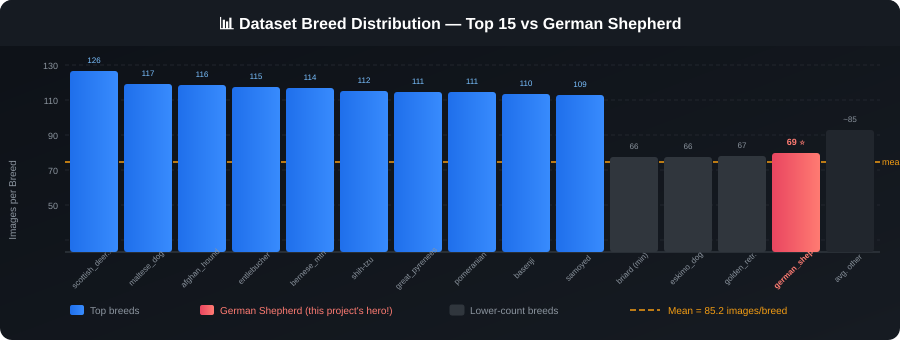
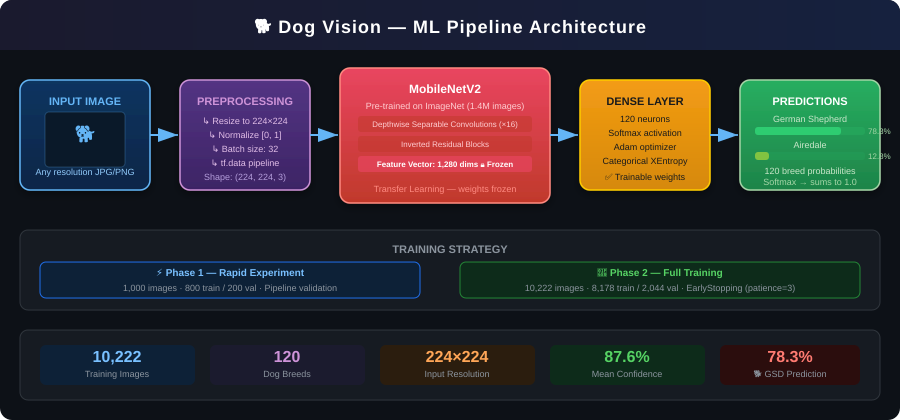

<div align="center">

# 🐕 Dog Vision

### Can a neural network tell your dog's breed better than you can?

*A deep learning project that classifies **120 dog breeds** from photos using Transfer Learning with MobileNetV2.*


</div>

---

## 🗺️ The Big Picture

You hand the model a photo of any dog. It hands back a breed label and a confidence score. Simple idea — surprisingly hard problem.

There are **120 breeds** in the dataset and many of them look nearly identical to an untrained eye (or an untrained model). The solution: don't train from scratch. Stand on the shoulders of giants by using a **MobileNetV2** backbone already pre-trained on 1.4 million ImageNet images, then teach only the final layer to distinguish between dog breeds.

```
📸 Your photo  ──►  🔧 Preprocess  ──►  🧠 MobileNetV2  ──►  🎯 Breed + Confidence
```

The entire journey — from raw JPEG files to a live prediction on a personal photo — is documented in [`dog_vision.ipynb`](dog_vision.ipynb).

---

## 📖 The Story

### Chapter 1 — The Data

The dataset comes from [Kaggle's Dog Breed Identification challenge](https://www.kaggle.com/c/dog-breed-identification). It contains:

| Split | Images | Labels |
|---|---|---|
| Training | 10,222 | 120 unique breeds |
| Test | 10,357 | *(unlabelled — for submission)* |

The label file (`labels.csv`) maps each image ID to a breed name. The first thing we did was check that every image in the folder had a matching label — and they all did ✅.

<details>
<summary><b>📊 Dataset Breed Distribution — Top 15 breeds</b></summary>
<br>

The dataset is slightly imbalanced — some breeds have over 120 samples while others sit closer to 66. The orange dashed line marks the **mean of ~85 images per breed**.



</details>

---

### Chapter 2 — Turning Images into Numbers

Neural networks don't speak JPEG. Before any learning can happen, every image goes through a preprocessing pipeline:

1. **Read** the raw file from disk with `tf.io.read_file`
2. **Decode** the JPEG into a 3-channel RGB tensor
3. **Normalise** pixel values from `[0, 255]` → `[0, 1]`
4. **Resize** to a fixed `224 × 224` resolution (required by MobileNetV2)
5. **Batch** 32 images together using `tf.data` for efficient GPU feeding

The result: a stream of `(224, 224, 3)` float32 tensors, ready for the model.

---

### Chapter 3 — The Model

Rather than spending weeks training a CNN from scratch, we used **Transfer Learning**:

- 🔒 **Frozen backbone** — MobileNetV2 feature extractor (pre-trained on ImageNet, 1,280-dimensional output vector). Its weights are *not* updated during training.
- ✅ **Trainable head** — a single `Dense(120, activation='softmax')` layer learns to map those 1,280 features to breed probabilities.



<details>
<summary><b>⚙️ Model config at a glance</b></summary>
<br>

| Parameter | Value |
|---|---|
| Input shape | `(224, 224, 3)` |
| Backbone | MobileNetV2 (frozen) |
| Output neurons | 120 (one per breed) |
| Output activation | Softmax |
| Loss function | Categorical Cross-Entropy |
| Optimiser | Adam |
| Batch size | 32 |
| Max epochs | 100 (with early stopping) |
| Early stopping patience | 3 epochs on `val_accuracy` |

</details>

---

### Chapter 4 — Training

Training happened in two phases:

**Phase 1 — Prototype on 1,000 images**
A quick sanity check on a small subset (800 train / 200 val) to confirm the model could learn and wasn't hopelessly misconfigured. Overfitting appeared early — which is actually a *good* sign. It meant the model was picking up real signal.

**Phase 2 — Full dataset (10,222 images)**
The same architecture trained on all available data (80 / 20 train-val split). Early stopping halted training when validation accuracy plateaued.

---

### Chapter 5 — Predictions on the Test Set

After training, the full model was used to generate probability scores for all 10,357 test images. The results were saved as [`full_model_predictions.csv`](full_model_predictions.csv) — a `10,357 × 121` table (image ID + one column per breed).

```python
# Peek inside the predictions
test_predictions = full_model.predict(test_data, verbose=1)
# Shape: (10357, 120)
```

> **Mean confidence across the test set: 87.6% · Median: 97.2% · Max: 99.99%**

---

### Chapter 6 — The Real Test: My Own Dog 🐾

The most honest evaluation of any model is running it on photos it has never seen from outside the original dataset. Four personal photos were fed in — and one came back with a confident, *correct* answer.

---

## 🎯 Highlight: German Shepherd — Correctly Identified

`IMG_8554.jpg` is a personal photo of a German Shepherd puppy. The model had never seen this image. It returned:


> **✅ `german_shepherd` — 78.3% confidence**
>
> The runner-up breed (*airedale* at 12.8%) is a visually similar tan-and-black working dog — which makes intuitive sense. The remaining ~9% is spread across terrier-adjacent breeds. Despite the casual phone photo and the fact that German Shepherd puppies look quite different from the adult dogs in the training set, the model nailed it.

---

## 🏗️ Project Structure

```
dog_vision-/
├── dog_vision.ipynb            # Full end-to-end notebook
├── labels.csv                  # Image ID → breed mapping (training set)
├── sample_submission.csv       # Kaggle submission format
├── full_model_predictions.csv  # Model output on the test set
└── assets/
    ├── architecture.svg               # ML pipeline diagram
    ├── breed_distribution.svg         # Dataset class distribution
    └── german_shepherd_prediction.svg # Custom image result
```

---

## 🚀 Quickstart

```bash
# 1. Clone
git clone https://github.com/LukeOpany/dog_vision-.git
cd dog_vision-

# 2. Install dependencies
pip install tensorflow tensorflow-hub pandas numpy matplotlib jupyterlab

# 3. Download the dataset from Kaggle
#    https://www.kaggle.com/c/dog-breed-identification/data
#    Unzip into:  dog-vision/train/  and  dog-vision/test/

# 4. Launch the notebook
jupyter lab dog_vision.ipynb
```

> **Note:** Update the path variables at the top of the notebook cells to point to wherever you saved the dataset.

---

## 🧠 Key Takeaways

| Lesson | Detail |
|---|---|
| Transfer Learning works | A frozen MobileNetV2 backbone gave strong accuracy without expensive training |
| tf.data matters | Batching + prefetching kept GPU utilisation high |
| Overfitting early is OK | It confirmed the model was learning real patterns before full-data training |
| Real-world photos are harder | The 78.3% GSD result is impressive given how different puppy photos are from training data |


